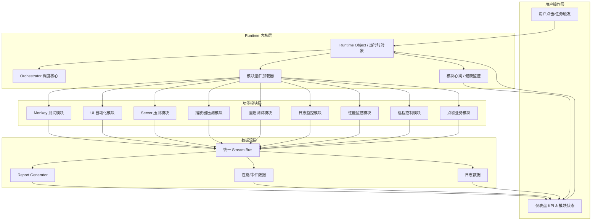

# Thunderstone 系统级优化与数据流图

## 一、架构总览（Mermaid）



---

## 二、图解说明

| 概念 | 说明 |
|------|------|
| **Runtime Object 统一管理** | 所有任务、模块、事件都挂在 Runtime 上，形成唯一生命周期 |
| **模块按需加载** | ModuleLoader 负责按任务类型动态加载模块插件 |
| **统一数据流** | Stream Bus 采集各模块数据（Metrics/Logs），统一发送给 Reports 生成报告 |
| **健康状态与 KPI** | HealthCheck 模块实时监控模块运行状态，Dashboard 可视化展示 |
| **仪表盘整合** | KPI、模块状态、报告一体化，用户可一眼了解系统全局状态 |

---

## 三、当前实现与架构对照

### 3.1 已有实现

| 架构组件 | 当前实现 | 路径/说明 |
|----------|----------|-----------|
| **Runtime Object** | TestRuntimeManager + TROM 模型 | `shared/core/runtime_manager.py`、`shared/core/trom.py` |
| **Orchestrator** | create_run / get_run / set_child / update_run | `shared/unified/orchestrator.py` |
| **仪表盘 KPI** | 在线设备、今日任务、异常警告、工具模块数 | `GET /api/dashboard/stats` |
| **健康检查** | 平台状态、模块加载、ADB 可用性 | `GET /api/health` |
| **Report Generator** | UnifiedReportStore、各模块报告 | `shared/unified/report_store.py`、`reports/unified/` |
| **一键任务** | 编排 Monkey、UI 自动化等 | `modules/unified/views.py` |
| **功能模块** | Monkey、UI 自动化、Server 压测、Player 压测、Reboot、Log 监控、Perf 监控、点歌等 | `modules/*/` |

### 3.2 已落地（本次实现）

| 架构组件 | 实现路径 | 说明 |
|----------|----------|------|
| **ModuleLoader** | `shared/core/module_loader.py`、`module_registry.py` | 模块注册、get_status、get_all_status、按 task_type 查询 |
| **ModulePlugin 接口** | `shared/core/module_plugin.py` | ModuleInfo、ModuleState、ModulePlugin ABC |
| **Stream Bus** | `shared/core/stream_bus.py` | publish(module, type, payload)、get_recent；Report 保存时自动 publish |
| **HealthCheck 增强** | `GET /api/health` | 聚合 module_status（各模块 heartbeat） |
| **Dashboard 模块状态** | 仪表盘「模块运行状态」卡片 | 调用 `GET /api/modules/status`，展示空闲/运行中/异常 |
| **Stream Bus API** | `GET /api/stream/recent` | 拉取最近事件，支持 types 过滤 |

### 3.3 待补齐 / 待优化

| 架构组件 | 当前状态 | 建议 |
|----------|----------|------|
| **Metrics/Logs 统一** | 各模块仍独立 SSE | 逐步让 Log 监控、性能监控等向 Stream Bus publish |
| **模块按需动态加载** | 启动时静态注册 | 支持热插拔、按任务类型懒加载 |

---

## 四、落地顺序建议

```
1. 建立 Runtime Object 与 Orchestrator 核心     ← 已有基础，可增强
2. 模块插件化改造 + ModuleLoader                ← 待实现
3. Stream Bus 数据统一 + Metrics/Logs/Reports  ← 待实现
4. HealthCheck 模块 + 仪表盘 KPI 可视化         ← KPI 已有，HealthCheck 待增强
5. 前端 Dashboard 整合和交互优化                ← 持续迭代
```

---

## 五、下一步可落地的具体任务

1. **ModuleLoader 抽象**：定义 `ModulePlugin` 接口（`start`/`stop`/`status`），各模块实现接口，由 Loader 按需加载。
2. **Stream Bus 接口**：定义 `StreamBus.publish(module, type, payload)`，各模块 SSE 改为向 Bus 推送，Dashboard/Reports 订阅。
3. **HealthCheck 增强**：各模块提供 `GET /api/status` 或 `heartbeat()`，`/api/health` 聚合各模块状态返回。
4. **Dashboard 模块状态卡片**：新增「模块运行状态」区域，展示各模块当前状态（空闲/运行中/异常）。
