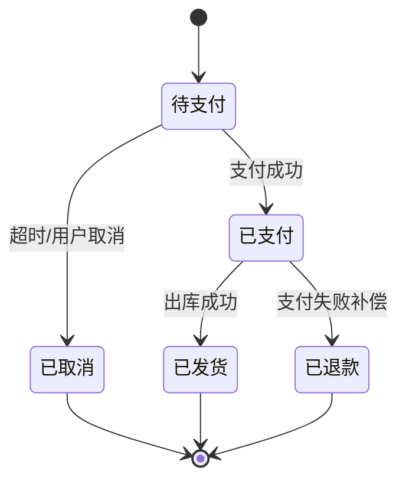

# PRD 审计助手平台介绍

## 平台名称
**PRD 审计助手（Trae PRD Audit）**

## 技术栈

- **后端**
  - Python
  - Flask（蓝图路由，非 FastAPI）
  - 规则引擎 + 解析流水线（Stage1/2/3 + Stage4/5 扩展）
- **前端**
  - Jinja2 模板 + 原生 JavaScript
  - Bootstrap / Font Awesome
  - Markdown 渲染与 Mermaid 图展示
- **数据/存储**
  - 文件型存储（JSON 为主）
  - 审计快照与学习仓库：`learning_repo/snapshots/*.json`
  - 规则库：`prd_scan_rules.json`、`prd_scan_rules_v2.json`
  - 额外知识资产：`knowledge_cards.json`、`bug_pattern.json`、`vector_data.json`
- **模块结构**
  - 主模块：`modules/prd_audit`
  - 独立可移植副本：`modules/prd_audit_clone`
  - 规则/提取支持模块：`modules/prd_outline`

## 现有能力

- 上传/输入 PRD（飞书链接、粘贴文本、PDF、DOCX）
- 三段式分析：
  - Stage1：结构解析（模块、流程、规则、状态、边界等）
  - Stage2：规则库漏洞扫描 + 可选 LLM 扫描
  - Stage3：L1/L2/L3 报告生成（支持本地兜底）
- 审计总览：
  - 质量评分、P0/P1/P2 分布
  - 漏洞卡片化展示与分类过滤
- 扩展分析能力：
  - PRD 内容大纲（认知对齐）
  - 测试矩阵、矩阵独立页
  - 系统图（Mermaid）、知识图谱推理
  - 平台影响、依赖分析、风险预测、发布门禁、理解卡片
- 学习与规则治理：
  - 历史快照
  - 候选规则生成 / 应用 / 发布 / 回滚
  - 质量看板、分轨统计
- 对外接口（节选）
  - `/api/generate`, `/api/analyze_prd`
  - `/api/parse_pdf`, `/api/parse_docx`
  - `/api/export_report_docx`, `/api/export_feature_xmind`
  - `/api/learning/*`, `/api/history/*`, `/api/knowledge_cards/*`

## 想新增的功能

- 自动从任意 PRD 提取所有异常场景并汇总成统一表格（无 LLM 规则版）
- 自动生成状态机 Mermaid 图并附校验信息（转移条件、异常回退、中断恢复）
- 全链路支持纯规则模式：
  - 不依赖大模型
  - 可配置规则模板与词典
  - 结果可追溯（命中规则 ID、锚点、证据片段）

## 典型 PRD 样例（示意）

```markdown
# 会员下单流程 PRD
## 1. 主流程
用户选择商品 -> 提交订单 -> 支付 -> 发货

## 2. 约束规则
- 每个用户同一商品每天限购 2 件
- 支付超时 15 分钟自动取消

## 3. 异常场景
- 库存不足时应提示并阻止下单
- 支付失败后可重试，不应重复扣款
- 订单取消后应释放库存
```

## 期望输出（示意）

### 1）异常场景汇总表

| 场景ID | 所属模块 | 异常描述 | 触发条件 | 系统期望行为 | 风险级别 | 规则命中 |
|---|---|---|---|---|---|---|
| EX-001 | 下单 | 库存不足下单 | 库存=0 | 阻止创建订单并提示 | P0 | R-STOCK-01 |
| EX-002 | 支付 | 支付失败重试 | 支付网关失败 | 可重试且防重复扣款 | P0 | R-PAY-03 |
| EX-003 | 订单 | 取消后库存一致性 | 订单取消 | 释放库存并记录日志 | P1 | R-ORDER-02 |

### 2）状态机 Mermaid


