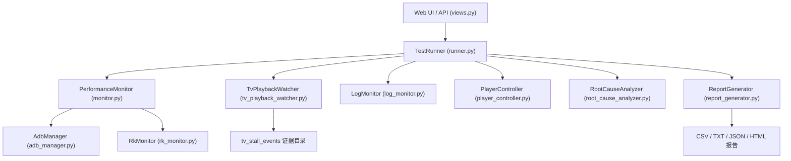

# 播放器压测模块技术文档

## 1. 文档目的

本文档说明 `player_stress` 模块的技术实现、代码结构、主流程、核心算法、事件模型、报告生成机制、测试覆盖与维护要点，面向研发与维护同学。

模块路径：

- `D:\trae-code\trae_platform\modules\player_stress`

---

## 2. 模块总体架构

系统由四层组成：

1. Web 接入层
2. 测试编排层
3. 数据采集与诊断层
4. 报告与证据输出层

可概括为：



---

## 3. 目录结构

核心目录：

```text
D:\trae-code\trae_platform\modules\player_stress
├─ config
├─ core
│  ├─ adb_manager.py
│  ├─ evaluator.py
│  ├─ image_analyzer.py
│  ├─ log_monitor.py
│  ├─ monitor.py
│  ├─ player_controller.py
│  ├─ report_generator.py
│  ├─ rk_monitor.py
│  ├─ root_cause_analyzer.py
│  ├─ runner.py
│  └─ tv_playback_watcher.py
├─ reports
├─ templates
└─ views.py
```

主要职责如下。

### 3.1 `views.py`

职责：

- 提供 Web 页面
- 提供 API 接口
- 维护测试线程、全局状态、日志缓冲区
- 负责证据目录访问与报告文件下载

关键全局状态：

- `TEST_INSTANCE`
- `TEST_THREAD`
- `TEST_RUN_STATE`
- `LOG_BUFFER`

### 3.2 `runner.py`

职责：

- 测试生命周期管理
- 启动各监控组件
- 执行播放策略
- 触发截图冻结检测
- 汇总 summary
- 输出 TXT / JSON / HTML / CSV

它是主编排器。

### 3.3 `monitor.py`

职责：

- 周期采集运行时快照
- 汇总 CPU / 内存 / FPS / decoder / thermal
- 维护电视端事件集合
- 生成最终 summary
- 调用 evaluator 评分

它是主数据面。

### 3.4 `tv_playback_watcher.py`

职责：

- 高频观察电视端播放状态
- 识别 `TV_STALL` 与 `TV_STALL_RISK`
- 自动生成单事件证据目录

### 3.5 `evaluator.py`

职责：

- 根据 summary 生成全局评分与准入结论
- 输出扣分项、阻断项、风险观察结论

### 3.6 `report_generator.py`

职责：

- 生成 HTML 报告
- 将 summary 翻译为用户可读视图

### 3.7 `root_cause_analyzer.py`

职责：

- 基于快照、进程、日志、解码信息给出根因候选与最终诊断

### 3.8 `adb_manager.py`

职责：

- 统一封装 ADB 调用
- 提供设备 IP、固件版本、平台身份、CPU 证据、温度信息等能力

---

## 4. 运行主流程

### 4.1 启动链路

1. 前端调用开始测试接口
2. `views.py` 创建后台线程 `run_test_background`
3. 创建 `LogMonitor`
4. 创建 `TestRunner`
5. `TestRunner.run()` 启动：
   - `PerformanceMonitor`
   - `TvPlaybackWatcher`
   - 播放策略
   - 异步截图检测
6. 测试结束后生成报告文件

### 4.2 状态流转

运行状态保存在 `TEST_RUN_STATE`：

- `idle`
- `running`
- `completed`
- `failed`
- `stopped`

同时保留：

- `started_at`
- `planned_end_at`
- `finished_at`
- `completion_reason`
- `report paths`

---

## 5. 数据采集机制

## 5.1 周期快照采集

`PerformanceMonitor.collect_snapshot()` 负责单次快照采集。

快照内容包括但不限于：

- PID
- 播放器 CPU
- 整机 CPU
- 内存 PSS
- MPP/decoder 状态
- Display / Surface / FPS
- thermal / CPU 频率
- OSD 观测
- 工具自身开销

所有快照保存在：

- `self.history`

### 5.2 Log 采集

`LogMonitor` 负责：

- 日志缓冲
- 卡顿关键字命中
- 切歌关键字识别

用于：

- 统计日志卡顿信号
- 辅助纯监控模式切歌窗口判断

### 5.3 电视端播放观察

`TvPlaybackWatcher` 独立于普通低频采样，主要做：

- 帧间隔异常检测
- 风险事件开始/恢复确认
- 事件证据快照保存

说明：

- 这是电视端“事件级证据”来源
- 不等价于 summary 中的普通周期采样

### 5.4 截图冻结检测

`runner.py` 配合 `image_analyzer.py` 做截图静止检测。

当前策略特点：

- 不再把“截图不动”直接等价成确认卡顿
- 必须结合旁证信号才升级

冻结事件分级：

- `confirmed`
- `risk`
- `ignored`

---

## 6. 关键检测算法

## 6.1 Display / Surface / FPS 证据链

目标：

- 明确当前观察的是不是电视端画面

链路包括：

1. Display 识别
2. Surface 锁定
3. FPS 采集

相关字段：

- `tv_display_id`
- `tv_display_verified`
- `tv_surface_locked`
- `tv_surface_name`
- `video_fps_source_counts`
- `video_fps_unavailable_reason`

### 6.2 解码停顿检测

核心依赖：

- `RkMonitor`
- MPP work_count

当前逻辑：

- decoder 活跃
- 但 work_count 在一定时间内不增长
- 且结合 Surface / 硬错误证据

分为：

- `decoder_stuck_confirmed`
- `decoder_stuck_risk`

汇总字段：

- `decoder_stuck_count`
- `confirmed_decoder_stuck_count`
- `decoder_stuck_risk_count`
- `decoder_stuck_summary`

### 6.3 电视端卡顿事件检测

`tv_playback_watcher.py` 主要负责：

- 风险启动确认
- 恢复确认
- 风险自动结束
- 确认级与风险级的切换

事件类型：

- `TV_STALL`
- `TV_STALL_RISK`

### 6.4 冻结检测与误报抑制

冻结检测现在做了三层控制：

1. 转场豁免
2. 静态页/无旁证不直接升级
3. 分成确认 / 风险 / 已忽略

新增机制：

- `mark_transition_window(...)`
- `ignore_transition_event_count`
- `ignore_video_metrics_total_sec`

### 6.5 风险事件去重

为避免报告出现大量重复事件，`monitor.py` 引入事件去重逻辑：

- `_dedupe_event_list(...)`

去重依据包含：

- 事件类型
- 嫌疑进程
- Display
- 时间桶
- 持续时间分桶
- 帧间隔分桶

汇总输出：

- `tv_stall_events_deduped`
- `tv_stall_risk_events_deduped`
- `tv_freeze_events_deduped`
- `duplicate_event_stats`

### 6.6 播放通路识别

用于回答“当前样本到底走的是哪条播放通路”。

相关函数：

- `_build_playback_path_observation(...)`
- `_summarize_playback_path(...)`

可能识别到的类型：

- `RK MPP 硬解通路`
- `MediaCodec / OMX 解码通路`
- `tvservice 旁路/轮播通路`
- `仅识别到显示层 Surface`

汇总输出：

- `playback_path_summary`

### 6.7 OSD 叠加层分析

用于回答“电视上方跑马灯 / 二维码 / Logo 是否影响显示”。

相关函数：

- `_build_osd_composition_summary(...)`

分析输入：

- OSD Surface
- OSD FPS
- OSD 最大帧间隔
- `tvservice` 等别名进程
- 风险事件中的 CPU 前后快照

---

## 7. 评分与准入算法

评分由：

- `PlayStateEvaluator.evaluate_global_score(...)`

负责。

### 7.1 评分输入

主要输入：

- Crash / ANR / PID 丢失
- 屏幕异常
- 内存增长
- 整机 CPU
- 电视端确认级卡顿
- 解码确认级停顿
- 风险样本

### 7.2 当前准入四档

当前输出：

- `建议上线`
- `建议灰度观察`
- `证据不足，暂不作上线结论`
- `不建议上线`

### 7.3 新增输出字段

为了提升报告可信度，新增了：

- `release_status`
- `risk_status`
- `risk_gate_reasons`
- `evidence_confidence_score`
- `evidence_confidence_label`

说明：

- `release_status` 是最终准入口径
- `risk_status` 是风险观察口径
- `risk_gate_reasons` 用于解释为什么进入灰度观察
- `evidence_confidence_*` 用于表达证据成熟度

### 7.4 阻断项

典型阻断项包括：

- 进程丢失
- 有效覆盖率过低
- 整机 CPU 持续高负载
- 确认电视端卡顿
- 确认解码输出停顿
- 未锁定电视端视频 Surface

---

## 8. 报告生成机制

### 8.1 TXT 报告

由 `runner.py` 生成，特点：

- 结构化强
- 适合快速文本阅读与归档

### 8.2 JSON 摘要

由 `runner.py` 输出，特点：

- 适合二次加工
- 适合平台和脚本读取

### 8.3 HTML 报告

由 `ReportGenerator.generate_report(...)` 生成，特点：

- 面向评审和展示
- 首页信息密度高
- 可视化更强

### 8.4 事件级证据目录

证据目录通常位于：

- `reports/tv_stall_events/...`

证据项包括：

- 事件摘要
- 截图
- logcat 时间窗
- CPU 快照
- top before/after
- decoder window

---

## 9. Web API 与页面状态

`views.py` 提供以下关键能力：

- 启动测试
- 停止测试
- 查询实时状态
- 查询最近事件
- 下载报告
- 查看事件证据

状态接口返回内容包括：

- 设备信息
- 日志缓冲
- 运行状态
- 实时监控摘要
- 历史快照

---

## 10. 配置项说明

配置来源：

- 前端表单
- `config.json`
- `views.py` 中组装的运行参数

关键配置包括：

- `tv_display_id`
- `auto_detect_tv_display`
- `allow_display0_fallback`
- `tv_freeze_threshold_seconds`
- `tv_stall_frame_gap_threshold_ms`
- `tv_stall_start_confirmations`
- `tv_stall_recovery_confirmations`
- `transition_ignore_seconds`
- `screen_check_interval_seconds`
- `screen_check_timeout_seconds`
- `pid_loss_abort_seconds`
- `pid_loss_abort_samples`

---

## 11. 测试覆盖

当前测试主要集中在：

- `D:\trae-code\trae_platform\tests\test_player_stress_tv_monitor.py`
- `D:\trae-code\trae_platform\tests\test_tv_playback_watcher.py`
- `D:\trae-code\trae_platform\tests\test_player_stress_accuracy_replay.py`

重点覆盖方向：

- CPU 证据解析
- 重复 shell 进程聚合
- firmware / platform 身份读取
- 证据清单生成
- TV freeze / TV stall 汇总
- 风险与确认分级
- 责任归因摘要
- OSD 辅助诊断
- 评分规则
- 报告 HTML 渲染

---

## 12. 当前技术边界

1. 不同芯片平台的 FPS / decoder 可观测性不完全一致
2. 部分设备缺少 thermal 节点或权限
3. OSD 识别依赖 Surface 命名和平台实现
4. 纯监控模式不等于完整业务链路压测
5. 如果缺少 Surface / FPS / decoder 直证，系统只应输出风险而不应硬定责

---

## 13. 维护建议

### 13.1 新增规则时

优先改三处：

- `monitor.py`：采集与 summary
- `evaluator.py`：评分与准入口径
- `report_generator.py` / `runner.py`：报告文案出口

### 13.2 改卡顿规则时

必须同步验证：

- 实时页是否一致
- TXT 是否一致
- HTML 是否一致
- JSON 是否一致

### 13.3 改事件类型时

必须同步更新：

- 事件汇总
- 去重逻辑
- 证据目录
- 文案解释
- 单测

### 13.4 上线前建议动作

建议至少做：

1. 编译检查
2. 单例服务确认
3. 本地最小实例构造验证
4. 关键单测回归
5. 真机短跑验证

---

## 14. 总结

从技术实现上看，`player_stress` 已经不是单一采样脚本，而是一套包含：

- 运行编排
- 多源采集
- 事件建模
- 根因诊断
- 报告生成
- 证据沉淀

的完整电视端播放器压测诊断系统。

当前最关键的技术特征有三点：

1. 电视端优先，而不是只看播放器进程
2. 风险、确认、证据不足明确分层
3. 结果可回溯到事件级证据目录

这也是它能持续向“可被研发信任的诊断工具”演进的基础。

